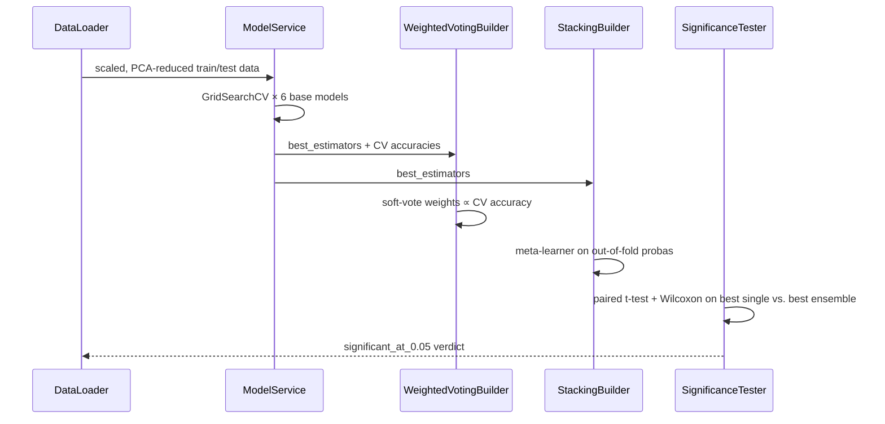

<div align="center">


# 📱 Ensemble-Driven Mobile Price-Range Classifier

### *Six Tuned Models. Two Ensembles. One Statistical Proof That It's Actually Better.*

[](https://python.org)
[](https://scikit-learn.org)
[](https://pandas.pydata.org)
[](https://scipy.org)
[](LICENSE)
[](http://makeapullrequest.com)

**Tune • Ensemble • Test for Significance • Report**

[Features](#-features) • [Design System](#-design-system) • [Architecture](#-architecture) • [Setup](#-setup) • [How the Comparison Works](#-how-the-ensemble-comparison-actually-works) • [Contributing](#-contributing)

</div>

---

## 📖 Overview

**PriceTrack** takes raw phone specs — RAM, battery, camera, screen, and more — and predicts a price-range class. It doesn't stop at "train a model and report accuracy": it grid-search-tunes six base learners, builds two competing ensembles (weighted soft voting and stacking), and runs paired significance tests to prove the ensemble actually beats the best single model rather than just looking better by chance.

<div align="center">

### 🎯 **Why This Project?**

| **Tuned, Not Guessed** | **Two Ensembles, Compared** | **Statistically Honest** | **Fully Reported** |
|:---:|:---:|:---:|:---:|
| Every base model grid-searched via `GridSearchCV` | Weighted voting vs. stacking, evaluated head-to-head | Paired t-test + Wilcoxon, not just "accuracy went up" | Every run auto-saves charts, heatmaps, and logs |

</div>

---

## ✨ Features

### 🧠 Model Pipeline

```mermaid
graph LR
    A[Raw CSV] --> B[Stratified Split + Scaling]
    B --> C[PCA Dimensionality Reduction]
    C --> D{GridSearchCV × 6 models}
    D --> E[Weighted Soft Voting]
    D --> F[Stacking Meta-Learner]
    E --> G{Significance Test}
    F --> G
    G --> H[Charts + Verdict]

    style A fill:#1c2130
    style H fill:#1a2340
```



- **Automated data pipeline** — CSV validation, stratified train/test split, `StandardScaler` feature scaling
- **PCA dimensionality reduction** — compresses 20 raw features while reporting exact variance retained
- **Six tuned base models** — Logistic Regression, KNN, Naive Bayes, SVM, Random Forest, Gradient Boosting, each optimized via `GridSearchCV`
- **Synthetic dataset generator** — reproducible sample data (`generate_dataset.py`) for local testing without a real dataset

### 🤝 Ensembles

| Model | How it's built |
|---|---|
| **Weighted Soft Voting** | Per-model weights derived directly from each model's own cross-validation accuracy — stronger models get more say |
| **Stacking** | A logistic-regression meta-learner trained on out-of-fold `predict_proba` outputs, so it never sees leaked training predictions |

### 📊 Statistical Significance Testing

- **Paired t-test** and **Wilcoxon signed-rank test** compare the best single model against the best ensemble on identical stratified CV folds
- A clear `significant_at_0.05` verdict — no hand-waving about "the ensemble looks better"

### 🖼️ Full Visual Reporting

- Accuracy comparison bar charts with error bars for CV mean ± std
- Confusion-matrix heatmaps for both ensembles, side by side
- A boxplot of the significance test with both p-values in the title
- Structured, timestamped, **Persian-language** console/log output at every stage

---

## 🎨 Design System

PriceTrack's plots use a single brand-gradient-inspired palette (`main.py`) instead of ad hoc colors scattered across chart calls:

```
Signature palette     #8C7CFF → #6C5CE7 → #3E7BFA   (test accuracy bars / CV markers)
Confusion matrices     Blues = Weighted Voting · Greens = Stacking
Chart chrome            Minimal gridlines, annotated bar values, single legend per figure
```

Everything lives inside `plot_all_results` and `plot_significance` in `main.py` — changing the palette is a one-file edit, not a find-and-replace across the codebase.

---

## 🏗️ Architecture

A layered pipeline with a strict responsibility split: `data → model → ensemble → reporting`.

```mermaid
graph TD
    L[data_loader.py] --> M[model_service.py]
    M --> E[ensemble_service.py]
    E --> R[main.py: reporting]
    M -->|zero plotting/IO imports| Pure[Pure scikit-learn · Independently Testable]

    style M fill:#1a2340
    style Pure fill:#241a40
```



```
.
├── data_loader.py            # DataLoader — CSV validation, stratified split, StandardScaler
├── model_service.py           # DimensionalityReducer (PCA) + ModelService (6 tuned base models)
├── ensemble_service.py        # WeightedVotingBuilder, StackingBuilder, EnsembleEvaluator, SignificanceTester
├── generate_dataset.py        # synthetic dataset generator for local testing
├── main.py                    # orchestrates the full pipeline + all chart generation
├── mobile_price_data.csv      # dataset
└── mobile_price_data.xlsx     # dataset (Excel copy)
```

**Why this split:** `DataLoader` owns nothing but ingestion and scaling, so it can be swapped for a different data source without touching model code. `ModelService` and `DimensionalityReducer` are pure scikit-learn wrappers with no I/O or plotting logic, which is what makes them independently testable. `ensemble_service.py` composes the tuned `best_estimators` from `ModelService` rather than retraining from scratch, so the ensembles always build on the exact same tuned hyperparameters used for the base-model comparison. `main.py` is the only file that touches `matplotlib`/`seaborn` — every other module stays plot-free and importable on its own.

---

## 🛠️ Requirements

| Tool | Version |
|---|---|
| Python | 3.10+ |
| scikit-learn | 1.3+ |
| pandas / numpy | latest |
| matplotlib / seaborn | latest |
| scipy | latest (for `ttest_rel`, `wilcoxon`) |

---

## 🚀 Setup

```bash
git clone <this-repo>
cd pricetrack
pip install -r requirements.txt
```

No dataset generation step is required if `mobile_price_data.csv` is already present — `generate_dataset.py` is only needed to regenerate a fresh synthetic dataset.

### Run

```bash
# (optional) regenerate the synthetic dataset
python generate_dataset.py

# run the full pipeline: PCA → tuning → ensembles → significance test → charts
python main.py
```

### Output

Running `main.py` produces:

- `base_models_accuracy.png` — test vs. CV accuracy for all six tuned base models
- `all_models_accuracy.png` — base models plus both ensembles, side by side
- `ensemble_confusion_matrices.png` — Voting vs. Stacking confusion matrices
- `significance_test.png` — boxplot of CV scores for the best single model vs. the best ensemble, with t-test and Wilcoxon p-values in the title
- Full console/log output at every stage: PCA variance retained, per-model accuracy, ensemble weights, and the final significance verdict

---

## 🔄 How the Ensemble Comparison Actually Works



1. All six base models are tuned independently via `GridSearchCV` on PCA-reduced, scaled features.
2. `WeightedVotingBuilder` assigns each model a soft-voting weight proportional to its own cross-validation accuracy — stronger models get more say.
3. `StackingBuilder` trains a logistic-regression meta-learner on the base models' out-of-fold probability outputs (`stack_method="predict_proba"`), so the meta-learner never sees leaked training predictions.
4. `EnsembleEvaluator` scores every model — base and ensemble — on both test accuracy and 5-fold CV accuracy for a fair, consistent comparison.
5. `SignificanceTester` re-runs stratified 5-fold CV for the best single model and the best ensemble on identical folds, then applies a paired t-test and a Wilcoxon signed-rank test to check whether the improvement is statistically real, not just noise.

---

## 🐛 Troubleshooting

<details>
<summary><b>DataLoadError: فایل دیتاست ... یافت نشد</b></summary>

Run `python generate_dataset.py` first, or place `mobile_price_data.csv` in the project root.

</details>

<details>
<summary><b>DataLoadError: ستون هدف ... وجود ندارد</b></summary>

Confirm the CSV has a `price_range` column, or pass a different `target_column` to `DataLoader`.

</details>

<details>
<summary><b>GridSearchCV runs very slowly</b></summary>

Reduce the parameter grids in `model_service.py`, or lower `n_jobs` if running on a memory-constrained machine.

</details>

<details>
<summary><b>wilcoxon returns None</b></summary>

Happens when the paired CV score differences are all zero (identical folds) — not a bug, just an edge case with too little variance to test.

</details>

<details>
<summary><b>Charts look empty or cut off</b></summary>

Make sure `matplotlib`'s backend can write files headlessly (`Agg`) if running on a server without a display.

</details>

For anything else, run `python main.py` directly (not through a wrapper) and read the actual traceback — the log messages are Persian, but exceptions are standard Python.

---

## 🤝 Contributing

Contributions are welcome! Here's how to get started:

```bash
# 1. Fork the repository on GitHub

# 2. Clone your fork
git clone https://github.com/YOUR_USERNAME/pricetrack.git

# 3. Create a feature branch
git checkout -b feature/your-feature-name

# 4. Make your changes and commit
git commit -m "Add: description of your change"

# 5. Push and open a Pull Request
git push origin feature/your-feature-name
```

### Areas to Contribute

| Area | Ideas |
|---|---|
| 🧠 **Modeling** | Add XGBoost/LightGBM as a base learner, Bayesian hyperparameter search |
| 🤝 **Ensembles** | Blending, multi-level stacking |
| 📊 **Stats** | Bootstrap confidence intervals, McNemar's test |
| 📖 **Docs** | Architecture deep-dive, dataset schema reference |
| 🧪 **Tests** | Unit tests for `DataLoader` edge cases and `SignificanceTester` |

---

## 📄 License

MIT — do whatever you'd like, just keep the license notice.

---

## 🙏 Acknowledgments

<div align="center">

### Built With Na7iD

[](https://python.org)
[](https://scikit-learn.org)
[](https://scipy.org)

### Special Thanks To

**scikit-learn Team** | **SciPy Maintainers** | **Open Source Contributors**
:---: | :---: | :---:
For tuning, ensembling, and evaluation primitives that just work | For rock-solid statistical testing tools | matplotlib, seaborn, pandas and more

</div>

---

<div align="center">


### ✨ **Built with ❤️ for people who don't trust an accuracy number without a p-value** ✨

[](https://github.com/7Na7iD7)

</div>
